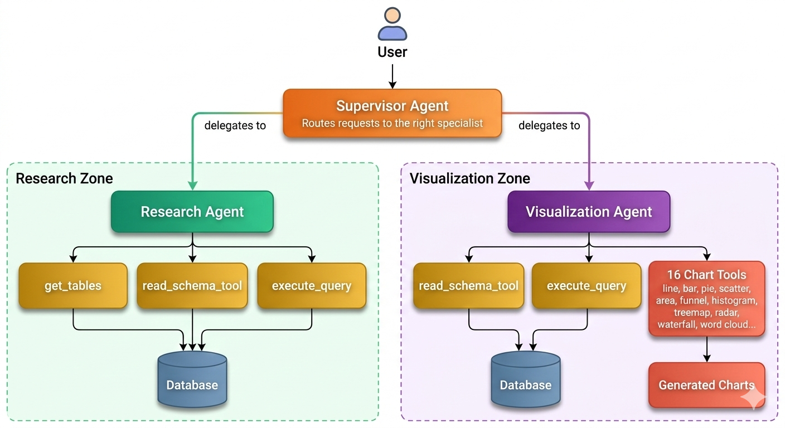

# AI Data Analytics Chatbot

An AI-powered chatbot that lets you query and visualize your database using plain English — no SQL needed.

## Architecture



## How it works

A **Supervisor Agent** receives the user's question and delegates to the right specialist:

- **Research Agent** — writes and executes SQL queries against the database
- **Visualization Agent** — generates charts from query results (16 chart types)

## Tech Stack

- **FastAPI** — WebSocket backend with real-time streaming
- **LangGraph / LangChain** — multi-agent orchestration
- **AWS Bedrock** — LLM backbone
- **SQLite** — session/chat history storage

## Getting Started

```bash
git clone https://github.com/Shashimaram/Building_bot.git
cd Building_bot
pip install -r requirements.txt
python app.py
```

Open `http://localhost:8000` and start chatting with your data.